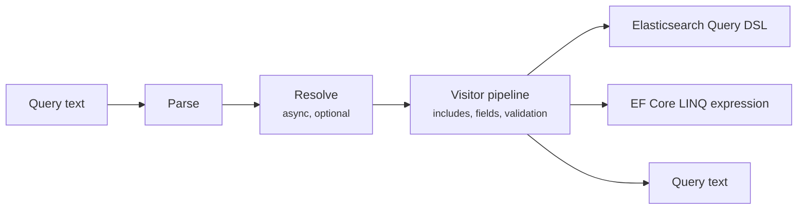

# What is Foundatio.Lucene?

Foundatio.Lucene lets the users of your application write search and filter queries in Lucene syntax — the syntax of Elasticsearch's `query_string`, Kibana, and Solr — and turns them into Elasticsearch queries or Entity Framework Core LINQ expressions. It also parses sort and aggregation expressions in the same syntax.

```
type:error AND (status:open OR status:regressed) AND created:[now-7d TO now] -tags:ignore
```

It is the successor to [Foundatio.Parsers](https://github.com/FoundatioFx/Foundatio.Parsers), with the same features, much better performance, and stricter, precisely specified behavior.

## How it works



1. **Parse.** A hand-written lexer and parser build a syntax tree. Parsing is fast, never throws for bad input, and reports every error with its position.
2. **Resolve.** When a parser has asynchronous dependencies — saved queries in a database, custom field names, an Elasticsearch mapping to load — they are resolved in one explicit async phase.
3. **Process.** A synchronous visitor pipeline expands includes, resolves field aliases, and enforces validation rules. Your own visitors can transform the tree.
4. **Build.** The provider turns the tree into its output.

## Features

- **Complete syntax**: terms, phrases, wildcards, fuzzy and proximity search, fields and field groups, inclusive, exclusive, and open ranges, comparison operators, boolean logic with standard precedence, boosts, regular expressions, existence checks, date math, and saved-query includes.
- **Elasticsearch**: mapping-aware translation (match vs term vs phrase, keyword and sort sub-fields, typed values), nested queries with correct correlation, geo distance and bounding boxes, date ranges with time zones, runtime fields, and aggregations and sorts.
- **Entity Framework Core**: filters and sorts that translate to SQL, with navigation properties, collections, and full-text search, limited to the fields your model exposes.
- **Field aliasing**: friendly names, hierarchical maps, and synchronous or asynchronous resolvers, per request or per tenant.
- **Validation**: allowed and restricted fields (including sub-fields and resolved names), allowed operations, depth limits, and leading-wildcard rules, enforced on every build.
- **Visitors**: analyze or rewrite queries; invert a query within a scope; remove fields; clean up; round-trip back to text.

## Next steps

- [Getting Started](./getting-started)
- [Query Syntax](./query-syntax)
- [Migrating from Foundatio.Parsers](./migrating-from-parsers)
